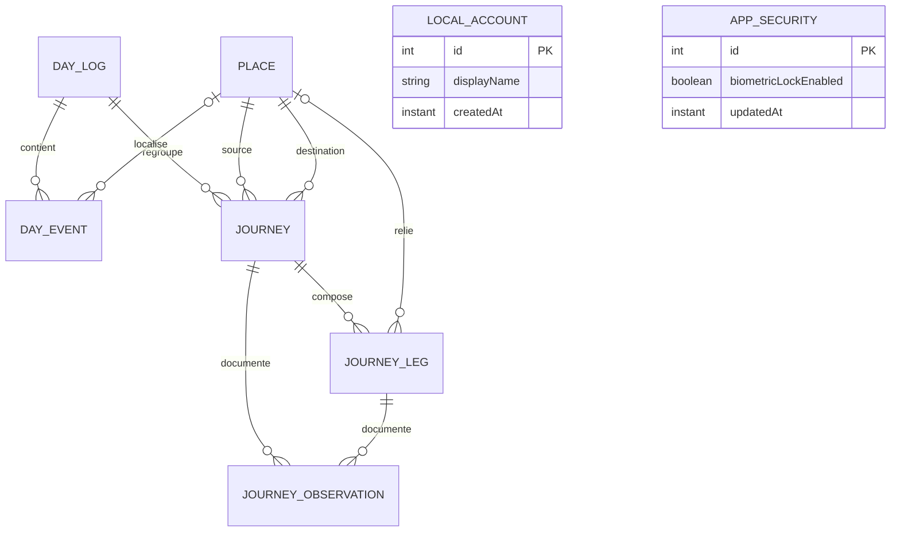

# Itinéraire

Itinéraire est une application Android personnelle destinée à enregistrer les habitudes de déplacement au fil d'une journée : événements importants, trajets, tronçons, modes de transport, temps passé et dépenses.

Le projet cherche d'abord à répondre à une question simple : **comment se déroule réellement un déplacement, de la source initiale à la destination finale ?**

## Philosophie du projet

### Local-first

L'application doit rester utilisable hors connexion. La base Room locale est la source de vérité et aucune donnée personnelle ne doit dépendre d'un service distant pour être consultée.

Une sauvegarde et une synchronisation pourront être ajoutées plus tard, sans remettre en cause le fonctionnement local.

### Enregistrer des faits

Les durées sont calculées à partir des heures de début et de fin enregistrées. Un chronomètre affiché à l'écran n'est jamais la source de vérité. Cette approche permet de conserver un trajet même si Android ferme l'application.

### Décomposer sans compliquer

Un trajet relie une source à une destination finale. Il peut contenir plusieurs tronçons lorsque le voyageur marche, change de véhicule ou passe par un point intermédiaire.

Exemple :

```text
Maison → ISC
├── Maison → Rond-point Ngaba : marche
├── Rond-point Ngaba → Victoire : taxi-bus, 1 500 CDF
└── Victoire → ISC : taxi, 1 500 CDF
```

L'interface doit rendre l'enregistrement rapide, tandis que le modèle de données conserve suffisamment de détails pour produire des statistiques utiles plus tard.

### Respecter la vie privée

Les déplacements peuvent révéler des informations sensibles. Les données sont donc privées et stockées dans l'espace local de l'application. Le propriétaire peut créer un profil local et activer un verrou biométrique s'il souhaite protéger l'accès, sans envoyer d'identité à un serveur. Ces deux options restent facultatives et indépendantes.

## Vocabulaire métier

- **Journée (`DayLog`)** : conteneur chronologique des activités d'une date.
- **Lieu (`Place`)** : endroit réutilisable, par exemple Maison, ISC, travail, église ou un arrêt.
- **Événement (`DayEvent`)** : fait ponctuel comme le réveil, la sortie de la maison ou une arrivée.
- **Trajet (`Journey`)** : déplacement complet entre une source et une destination finale.
- **Tronçon (`JourneyLeg`)** : partie d'un trajet effectuée avec un mode de transport donné.
- **Observation (`JourneyObservation`)** : information contextuelle comme une attente, un embouteillage, une panne ou la météo.
- **Profil local (`LocalAccount`)** : identité facultative stockée uniquement sur le téléphone.
- **Sécurité (`AppSecurity`)** : préférence indépendante qui indique si l'application doit être verrouillée.
- **Thème (`ThemeMode`)** : préférence locale d'apparence, réglée sur système, clair ou sombre.

## Modèle de données



Les coûts sont enregistrés sous forme d'entiers (`Long`) pour éviter les erreurs d'arrondi. La devise initiale est le franc congolais (`CDF`). Les identifiants sont des UUID afin de préparer l'export et une éventuelle synchronisation.

## Architecture

Le projet utilise une architecture en couches avec flux de données unidirectionnel :

```text
Écran Compose
    ↓ actions       ↑ état observable
ViewModel
    ↓
Repository
    ↓
DAO Room
    ↓
SQLite local
```

Les principales responsabilités sont réparties ainsi :

```text
com.mascode.itineraire
├── data
│   ├── local
│   │   ├── dao          Requêtes Room
│   │   └── entity       Tables de la base
│   └── repository       Accès métier aux données
├── domain
│   └── model            Types et concepts métier
├── ui
│   ├── today            Journée et trajet actif
│   ├── auth             Verrou biométrique facultatif
│   ├── history          Historique des trajets
│   ├── places           Gestion des lieux
│   ├── settings         Paramètres, profil et sécurité
│   └── navigation       Navigation principale
└── AppContainer.kt      Création des dépendances
```

L'injection des dépendances est volontairement manuelle pour garder le projet simple. Une solution dédiée ne devra être introduite que si la taille de l'application le justifie.

## État actuel

La version actuelle permet de :

- utiliser l'application sans créer de compte ni activer de protection ;
- créer, modifier ou supprimer un profil local facultatif depuis une page dédiée ;
- activer facultativement la protection par empreinte, visage compatible ou verrouillage du téléphone ;
- créer et consulter des lieux ;
- enregistrer le réveil et la sortie de la maison ;
- démarrer et terminer un trajet entre deux lieux ;
- consulter la durée des trajets dans l'historique ;
- consulter un premier écran de paramètres ;
- choisir un thème clair, sombre ou synchronisé avec celui du téléphone ;
- consulter la politique de confidentialité directement dans les paramètres ;
- conserver toutes les informations dans une base Room locale.

Les entités pour les tronçons et les observations existent déjà, mais leur parcours de saisie reste à construire.

## Sécurité et authentification

Le profil local et la protection de l'application sont deux options indépendantes. Le profil sert uniquement à personnaliser l'expérience ; il ne demande ni adresse électronique ni mot de passe et n'est envoyé à aucun serveur. L'application reste entièrement utilisable sans profil.

La protection s'active explicitement dans **Paramètres → Sécurité et authentification**. L'application utilise alors le dialogue système `BiometricPrompt` avec `BIOMETRIC_WEAK | DEVICE_CREDENTIAL`. Selon le matériel et la configuration de l'appareil, Android propose une empreinte, une reconnaissance faciale compatible ou le code, schéma ou mot de passe de verrouillage. L'application n'accède jamais directement aux données biométriques. Voir la [documentation Android sur l'authentification biométrique](https://developer.android.com/identity/sign-in/biometric-auth).

Lorsque la protection est active, l'accès est reverrouillé dès que l'application passe en arrière-plan. Lorsqu'elle est inactive, aucun écran d'authentification n'est affiché. Les pages Profil, Sécurité et Verrouillage utilisent les couleurs Material du thème clair ou sombre actif. Cette protection contrôle l'interface mais ne chiffre pas encore le fichier SQLite lui-même ; le chiffrement local pourra constituer une couche de sécurité supplémentaire.

## Apparence

Le thème se choisit dans **Paramètres → Thème**. Trois modes sont disponibles : suivre automatiquement le thème Android, conserver le thème clair ou conserver le thème sombre. Le choix est appliqué immédiatement, sauvegardé dans les préférences privées locales et transmis au système Android afin que l'écran de démarrage utilise lui aussi l'apparence sélectionnée.

## Politique de confidentialité

La politique est consultable hors connexion dans **Paramètres → Politique de confidentialité**. Elle décrit les données saisies, leur utilisation, le stockage local, le rôle du système Android dans l'authentification biométrique et les éventuelles sauvegardes système. Elle doit être actualisée avant toute intégration de géolocalisation, synchronisation, sauvegarde distante, analyse d'usage, publicité ou autre service tiers.

## Environnement de développement

- Kotlin et Jetpack Compose
- Material 3
- Room sur SQLite
- Navigation Compose
- Gradle avec Java 21
- `minSdk = 36`
- `compileSdk = 36.1`

Le niveau Android minimal élevé est un choix assumé pour l'usage personnel initial du projet.

## Identité visuelle

L'icône représente une épingle de géolocalisation reliée à un petit tracé. Elle reprend le bordeaux du thème sombre et le cyan utilisé comme couleur d'accent dans l'application.

La source haute résolution est conservée dans `design/app-icon-source.png`. Les variantes Android classiques, rondes et adaptatives peuvent être régénérées avec Java 21 :

```bash
java tools/GenerateLauncherIcons.java design/app-icon-source.png app/src/main/res
```

Le générateur produit les ressources pour les densités `mdpi`, `hdpi`, `xhdpi`, `xxhdpi` et `xxxhdpi`. Une version monochrome vectorielle est également fournie pour les lanceurs Android qui appliquent des icônes thématiques.

## Lancer le projet

1. Ouvrir le dossier dans Android Studio.
2. Installer le SDK Android 36 avec l'API mineure utilisée par le projet.
3. Utiliser Java 21 pour Gradle.
4. Synchroniser les dépendances.
5. Connecter un appareil Android 36 ou démarrer un émulateur compatible.

Commandes utiles :

```bash
./gradlew assembleDebug
./gradlew testDebugUnitTest
./gradlew lintDebug
./gradlew installDebug
```

L'APK de développement est généré dans `app/build/outputs/apk/debug/`.

## Base de données et migrations

Le schéma Room est exporté dans :

```text
app/schemas/com.mascode.itineraire.data.local.ItineraireDatabase/
```

Lors d'une modification de table :

1. augmenter la version de `ItineraireDatabase` ;
2. écrire une migration explicite ;
3. conserver le nouveau fichier JSON du schéma ;
4. tester la migration avec des données existantes ;
5. ne pas utiliser de migration destructive pour contourner le problème.

## Principes de contribution

- Room reste la source de vérité pour les données métier.
- Les composants Compose affichent un état et transmettent des actions ; ils ne parlent pas directement aux DAO.
- Une `Activity` ne conserve pas les données de l'application.
- Les dates absolues utilisent `Instant` et les journées civiles utilisent `LocalDate`.
- Les fonctions non disponibles doivent être présentées comme « à venir », et non simulées.
- Chaque modification doit être compilée et vérifiée avant son commit.
- Toute évolution importante doit mettre à jour ce README dans le même groupe de modifications, notamment les sections concernant l'état actuel, l'architecture et les prochaines étapes.
- Les commits sont rédigés en français et regroupés par apport fonctionnel cohérent.

Exemples de messages :

```text
Ajouter la gestion des tronçons
Enregistrer les coûts de transport
Afficher les statistiques mensuelles
```

## Prochaines étapes

1. Saisie et modification des tronçons.
2. Modes de transport, coûts en CDF et temps d'attente.
3. Observations pendant un trajet.
4. Modification et suppression des données.
5. Statistiques par période et par itinéraire.
6. Export et restauration locale.
7. Sauvegarde en ligne et identité distante facultatives, distinctes du compte local.
8. Géolocalisation facultative.
