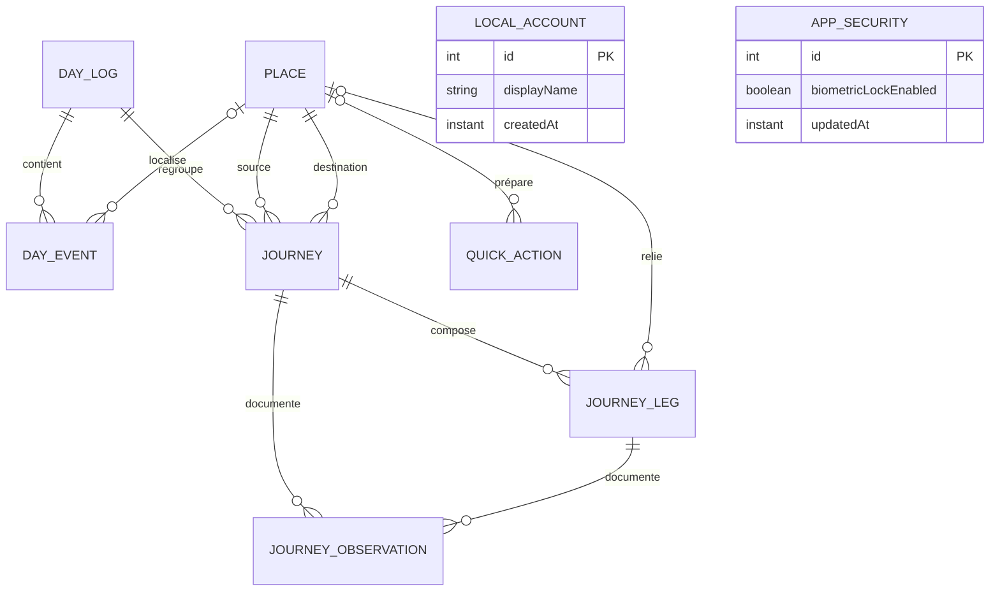

# Itinéraire

Itinéraire est une application Android personnelle destinée à enregistrer les habitudes de déplacement au fil d'une journée : événements importants, trajets, tronçons, modes de transport, temps passé et dépenses.

Le projet cherche d'abord à répondre à une question simple : **comment se déroule réellement un déplacement, de la source initiale à la destination finale ?**

## Philosophie du projet

### Local-first

L'application doit rester utilisable hors connexion. La base Room locale est la source de vérité et aucune donnée personnelle ne doit dépendre d'un service distant pour être consultée.

L'utilisateur peut exporter et restaurer une sauvegarde locale complète. Une synchronisation entre appareils pourra être ajoutée plus tard, sans remettre en cause le fonctionnement local.

### Enregistrer des faits

Les durées sont calculées à partir des heures de début et de fin enregistrées. Un chronomètre affiché à l'écran n'est jamais la source de vérité. Cette approche permet de conserver un trajet même si Android ferme l'application.

### Décomposer sans compliquer

Un trajet relie une source à une destination finale. Il peut contenir plusieurs tronçons lorsque le voyageur marche, change de véhicule ou passe par un point intermédiaire.

Exemple :

```text
Maison → ISC
├── Maison → Rond-point Ngaba : marche
├── Rond-point Ngaba → Victoire : taxi-bus, 1 500 CDF
└── Victoire → ISC : taxi, 1 500 CDF
```

L'interface doit rendre l'enregistrement rapide, tandis que le modèle de données conserve suffisamment de détails pour produire des statistiques utiles plus tard.

### Respecter la vie privée

Les déplacements peuvent révéler des informations sensibles. Les données sont donc privées et stockées dans l'espace local de l'application. Le propriétaire peut créer un profil local et activer un verrou biométrique s'il souhaite protéger l'accès, sans envoyer d'identité à un serveur. Ces deux options restent facultatives et indépendantes.

## Vocabulaire métier

- **Journée (`DayLog`)** : conteneur chronologique des activités d'une date.
- **Lieu (`Place`)** : endroit réutilisable, par exemple Maison, ISC, travail, église ou un arrêt, avec une position géographique facultative.
- **Événement (`DayEvent`)** : fait ponctuel comme le réveil, la sortie de la maison ou une arrivée.
- **Action rapide (`QuickAction`)** : raccourci personnalisé qui enregistre immédiatement un type d'événement, avec un lieu et une note facultatifs.
- **Trajet (`Journey`)** : déplacement complet entre une source et une destination finale.
- **Tronçon (`JourneyLeg`)** : partie d'un trajet effectuée avec un mode de transport donné.
- **Observation (`JourneyObservation`)** : information contextuelle comme une attente, un embouteillage, une panne ou la météo.
- **Profil local (`LocalAccount`)** : identité facultative stockée uniquement sur le téléphone.
- **Sécurité (`AppSecurity`)** : préférence indépendante qui indique si l'application doit être verrouillée.
- **Thème (`ThemeMode`)** : préférence locale d'apparence, réglée sur système, clair ou sombre.

## Modèle de données



Les coûts sont enregistrés sous forme d'entiers (`Long`) pour éviter les erreurs d'arrondi. La devise initiale est le franc congolais (`CDF`). Les identifiants sont des UUID afin de préparer l'export et une éventuelle synchronisation.

## Architecture

Le projet utilise une architecture en couches avec flux de données unidirectionnel :

```text
Écran Compose
    ↓ actions       ↑ état observable
ViewModel
    ↓
Repository
    ↓
DAO Room
    ↓
SQLite local
```

Les principales responsabilités sont réparties ainsi :

```text
com.mascode.itineraire
├── data
│   ├── local
│   │   ├── dao          Requêtes Room
│   │   └── entity       Tables de la base
│   └── repository       Accès métier aux données
├── domain
│   └── model            Types et concepts métier
├── ui
│   ├── today            Journée et trajet actif
│   ├── journey          Création, suivi détaillé et résumé d'un trajet
│   ├── auth             Verrou biométrique facultatif
│   ├── history          Historique des trajets
│   ├── places           Gestion des lieux
│   ├── settings         Paramètres, profil et sécurité
│   └── navigation       Navigation principale
└── AppContainer.kt      Création des dépendances
```

L'injection des dépendances est volontairement manuelle pour garder le projet simple. Une solution dédiée ne devra être introduite que si la taille de l'application le justifie.

## État actuel

La version actuelle `1.10.0` permet de :

- utiliser l'application sans créer de compte ni activer de protection ;
- créer, modifier ou supprimer un profil local facultatif depuis une page dédiée ;
- activer facultativement la protection par empreinte, visage compatible ou verrouillage du téléphone ;
- créer et consulter des lieux classés par catégories (maison, études, travail, transport, santé, commerce et autres) depuis une page dédiée ;
- commencer automatiquement les noms et les phrases par une majuscule dans les champs textuels compatibles ;
- rechercher les lieux enregistrés et repérer immédiatement leur catégorie et la présence d'une position ;
- associer facultativement un lieu à la position actuelle du téléphone, lors de sa création ou plus tard ;
- modifier le nom, la catégorie ou la position d'un lieu depuis la liste des lieux ;
- enregistrer rapidement le réveil et la sortie de la maison ;
- créer un événement Réveil, Sortie de la maison, Arrivée, Activité ou Fin de journée avec une heure, un lieu et une note facultatifs ;
- créer et supprimer des actions rapides personnalisées, en plus des raccourcis Réveil et Sortie maison fournis par défaut ;
- préparer un trajet dans un écran dédié et défilable, puis le démarrer entre deux lieux ;
- préparer facultativement les tronçons et leur transport avant le démarrage du trajet ;
- inverser rapidement le lieu de départ et la destination avant le démarrage ;
- terminer un trajet en cours ;
- terminer un trajet simple sans créer de tronçon ;
- décomposer un trajet en tronçons avec lieux, transport, horaires, durée, prix en CDF et notes ;
- afficher le trajet en cours dans un widget Android et passer au tronçon suivant sans ouvrir l'application ;
- suivre le tronçon actif dans une notification persistante prioritaire avec chronomètre et action rapide ;
- retrouver les tronçons terminés rapidement depuis le widget ou la notification dans un écran **Données à compléter** ;
- signaler les embouteillages, attentes, pannes, problèmes météo et autres observations ;
- consulter le résumé détaillé et le coût total d'un trajet depuis l'historique ;
- consulter le bilan d'un trajet terminé avec durée, distance, dépense et répartition par transport ;
- parcourir une chronologie unifiée du départ, des tronçons, des observations et de l'arrivée ;
- parcourir un historique regroupé par journée, filtrer les trajets par état et consulter une synthèse globale ;
- modifier ou supprimer un trajet terminé, ses tronçons, les événements et les actions rapides personnalisées ;
- demander une confirmation explicite avant chaque suppression destructive ;
- consulter dans le résumé la distance Haversine estimée lorsque les lieux possèdent une position ;
- consulter un premier écran de paramètres ;
- choisir un thème clair, sombre ou synchronisé avec celui du téléphone ;
- consulter la politique de confidentialité directement dans les paramètres ;
- naviguer entre les quatre sections principales par glissement horizontal ou avec le menu inférieur ;
- parcourir les journées avec les flèches de l'accueil ou sélectionner directement une date dans le calendrier ;
- conserver toutes les informations dans une base Room locale ;
- exporter toutes les données dans un fichier JSON choisi par l'utilisateur et restaurer une sauvegarde valide ;
- confier à Android une sauvegarde système chiffrée et le transfert vers un nouvel appareil lorsque les réglages du téléphone l'autorisent.

La position facultative permet de calculer dans le résumé une distance à vol d'oiseau avec la formule de Haversine. Lorsque tous les tronçons sont localisés, leurs distances sont additionnées ; sinon, le calcul relie directement la source et la destination finales si leurs positions sont disponibles. Cette estimation ne représente pas la longueur réelle du réseau routier. Une position n'est pas nécessaire pour enregistrer ou utiliser un lieu.

## Démarrage d'un trajet

Depuis l'accueil, **Commencer un trajet** ouvre une page complète et non une fenêtre modale. Le départ et la destination sont présentés dans un résumé compact ; la liste de lieux n'apparaît que lorsque l'utilisateur choisit de modifier l'un des deux. Cette organisation reste utilisable lorsque la base contient beaucoup de lieux et laisse de la place pour enrichir ultérieurement la préparation du trajet.

Le bouton de démarrage reste accessible en bas de l'écran. Il crée le trajet dans la journée courante avec les mêmes dépôts Room que le reste de l'application, puis ouvre son suivi détaillé. Revenir en arrière ne crée rien. Cette évolution d'interface ne modifie ni le schéma de la base locale ni les trajets, lieux et événements déjà enregistrés.

Les tronçons sont facultatifs. Un déplacement simple peut être terminé directement et conserver sa source, sa destination, sa durée totale ainsi que sa distance estimée lorsque les lieux sont géolocalisés. Lorsqu'au moins un tronçon est ajouté, le dernier doit toujours atteindre la destination finale avant la clôture du trajet.

Pendant la préparation, l'utilisateur peut définir une suite continue de tronçons avec leurs lieux et modes de transport. Ces étapes sont enregistrées comme des tronçons prévus, sans fabriquer d'horaires. Dans le trajet en cours, **Commencer ce tronçon** transforme l'étape suivante en tronçon réel et enregistre seulement à cet instant son heure de départ. Retirer une étape prévue retire également les suivantes afin de ne pas conserver un itinéraire discontinu.

Les étapes intermédiaires encore prévues peuvent être réordonnées par un appui long suivi d'un glissement vertical. Après le déplacement, leurs points de départ sont recalculés pour conserver un parcours continu et un message Android confirme l'enregistrement. Le dernier tronçon reste verrouillé, car son arrivée doit correspondre à la destination finale du trajet.

## Widget du trajet en cours

Le widget Android se trouve dans le sélecteur de widgets du lanceur. Il peut aussi être demandé depuis **Paramètres → Widget du trajet** lorsque le lanceur accepte l'épinglage direct. Son format redimensionnable affiche le trajet, le tronçon actif, son heure de départ et le prochain tronçon prévu.

Le bouton **Terminer et continuer** clôt le tronçon actif et démarre immédiatement le suivant sans ouvrir l'application. Cette opération est atomique dans Room : le nouveau tronçon commence exactement à l'heure de fin du précédent. Le coût du tronçon terminé est marqué comme restant à compléter et peut être saisi plus tard depuis l'Historique.

Si le verrou biométrique est activé, le widget masque les lieux et désactive l'action rapide afin de ne pas exposer les habitudes de déplacement sur l'écran d'accueil. Sans verrou, toute personne ayant accès au téléphone déverrouillé peut consulter et utiliser le widget.

## Notification du trajet en cours

Après autorisation de l'utilisateur, une notification persistante apparaît uniquement lorsqu'un tronçon est actif. Son canal utilise une importance Android élevée afin de ne pas être classé dans la section silencieuse et de rester prioritaire sur l'écran verrouillé. Une seule alerte est émise au démarrage ; les mises à jour suivantes restent discrètes. Elle affiche le trajet global, le tronçon courant, le prochain point prévu et un chronomètre calculé depuis l'heure réelle de départ.

L'action **Terminer et continuer** réutilise la même transaction Room que le widget : elle clôt exactement un tronçon et démarre le suivant à la même heure. Sur le dernier tronçon, l'action devient **Terminer le tronçon** et la notification disparaît dès qu'aucun tronçon n'est actif. Android exige que l'appareil soit déverrouillé avant d'exécuter cette action.

Sur Android 16.1 et les versions compatibles, l'application demande au système de présenter cette notification comme une mise à jour en direct. Sur les autres versions prises en charge, elle reste une notification persistante standard. L'application n'usurpe pas les contrôles d'un lecteur multimédia et ne démarre aucun suivi GPS en arrière-plan.

Un service de premier plan de type Android `specialUse` reste actif pendant le tronçon afin de maintenir la notification et ses actions lorsque l'application quitte l'écran. Il s'arrête automatiquement dès qu'il n'existe plus de tronçon actif. Ce service ne collecte aucune position, n'utilise pas le réseau et ne crée aucune nouvelle donnée de déplacement par lui-même.

La notification possède une version publique générique afin de rester visible sur l'écran verrouillé sans révéler automatiquement les lieux. Lorsque la protection biométrique est active, elle masque également les lieux dans le volet des notifications et ne propose aucune action directe. L'autorisation et le canal peuvent être gérés depuis **Paramètres → Notification du trajet**.

## Événements et actions rapides

Un événement est une information enregistrée dans la journée avec une heure précise. Sa création détaillée permet de choisir son type, un lieu et une note facultatifs. Les événements Réveil et Sortie de la maison disposent également de raccourcis fixes sur l'accueil.

L'utilisateur peut ajouter ses propres actions rapides depuis **Accueil → Gérer les actions rapides**. Une action possède un libellé, un type d'événement, un lieu et une note facultatifs. Un appui sur son bouton enregistre immédiatement l'événement à l'heure actuelle. Les actions personnalisées sont conservées dans Room et peuvent être supprimées depuis leur page de gestion.

Un appui sur un événement de l'accueil ouvre son écran de modification avec le type, l'heure, le lieu et la note existants. L'écran permet aussi de le supprimer après confirmation. Dans la gestion des actions rapides, l'icône de modification recharge l'action dans le formulaire ; la suppression demande également une confirmation et ne supprime pas les événements déjà créés avec cette action.

## Historique des trajets

L'historique présente une synthèse du nombre de trajets, des trajets terminés et du temps total des déplacements achevés. Les filtres **Tous**, **Terminés**, **En cours** et **Annulés** permettent de retrouver rapidement un déplacement selon son état.

Les trajets sont regroupés par journée et affichent leur itinéraire, leur heure de départ, leur statut, leur durée et leur heure d'arrivée lorsqu'elles sont disponibles. Un appui sur une carte ouvre le détail complet du trajet sans modifier les données enregistrées.

Lorsqu'un tronçon a été terminé rapidement depuis le widget ou la notification, une carte visible dans l'Historique indique le nombre d'éléments à compléter. Elle ouvre une liste dédiée puis un éditeur plein écran, sans fenêtre modale. L'utilisateur peut y saisir le prix en CDF et corriger les lieux, le transport, les horaires et les notes avant validation. Les horaires utilisent les sélecteurs Material de date et d'heure avec les valeurs enregistrées déjà présélectionnées ; aucune date complète ne doit être saisie au clavier. La validation retire uniquement le marqueur « à compléter » ; elle conserve le tronçon, son trajet et toutes les autres données locales.

Depuis le résumé d'un trajet terminé ou annulé, chaque tronçon terminé peut être modifié dans un écran complet : lieux, transport, horaires, prix et notes. Le trajet lui-même possède un éditeur pour sa source, sa destination, ses horaires globaux et ses notes. Un trajet actif ne peut pas être supprimé ni modifié par ces écrans afin de protéger le suivi en cours.

Le résumé terminé présente un bilan avec la durée totale, la distance Haversine disponible, la dépense totale et le nombre de tronçons. La répartition par transport regroupe les tronçons de même mode et affiche pour chacun leur nombre, leur durée cumulée, leur coût et leur distance calculable. Si certains lieux ne sont pas localisés, l'interface distingue une distance directe entre les extrémités du trajet d'une distance totale calculée sur tous les tronçons.

La chronologie complète fusionne dans l'ordre réel le départ du trajet, le début et la fin de chaque tronçon, les observations et l'arrivée finale ou l'annulation. Lorsque la fin d'un tronçon et le début du suivant partagent la même heure, la fin apparaît d'abord. Les fins de tronçon donnent accès à leur modification sans quitter le résumé général.

La suppression d'un tronçon conserve le trajet et ses autres étapes. La suppression d'un trajet est définitive et entraîne, grâce aux relations Room, la suppression de ses tronçons, étapes prévues et observations. Une confirmation décrit cette conséquence avant l'opération. Retirer un tronçon encore prévu demande également confirmation et retire les étapes suivantes, conformément à la continuité du parcours.

## Sauvegarde et restauration

La page **Paramètres → Sauvegarde et restauration** permet de créer un fichier JSON versionné avec toutes les tables Room : profil local, sécurité, lieux, journées, événements, trajets, tronçons prévus ou effectués, observations et actions rapides. Le sélecteur de documents Android laisse l'utilisateur enregistrer ce fichier dans le stockage local, sur une carte mémoire ou auprès d'un fournisseur cloud installé, sans permission générale d'accès aux fichiers.

Avant une restauration, l'application contrôle l'origine, la version, les tables et les colonnes du fichier. Les données ne sont remplacées qu'après une confirmation explicite et dans une transaction Room unique : une erreur annule toute l'opération et préserve la base existante. Le format JSON manuel n'est pas encore chiffré et doit être conservé dans un emplacement sûr.

Android Auto Backup et le transfert entre appareils incluent la base principale et la préférence de thème. La sauvegarde cloud automatique exige les capacités de chiffrement du système. Ce mécanisme dépend du compte et des réglages de sauvegarde Android ; il complète l'export manuel mais ne le remplace pas.

## Géolocalisation facultative

La liste des lieux présente une synthèse des positions enregistrées, une recherche par nom ou catégorie et des cartes illustrées selon chaque type de lieu. La création et la modification utilisent une page dédiée structurée en trois parties : identité, catégorie et position facultative. La catégorie sélectionnée reste clairement mise en valeur.

Un lieu peut être enregistré sans coordonnées. Lorsque l'utilisateur se trouve à cet endroit, il peut employer **Utiliser ma position actuelle** pour ajouter ses coordonnées. Cette position peut ensuite être remplacée ou retirée en modifiant le lieu depuis la liste.

La localisation est demandée uniquement après une action explicite sur **Utiliser ma position actuelle**. L'application interroge les fournisseurs fusionné, réseau et GPS disponibles au lieu d'attendre uniquement un signal satellite. Une position très récente du téléphone peut être utilisée immédiatement ; après un délai maximal, une position mémorisée depuis moins de dix minutes sert de secours et l'interface l'indique clairement. Une position approximative reste acceptée, aucun accès en arrière-plan n'est demandé et aucun suivi continu n'est effectué. Les coordonnées retenues sont enregistrées avec le lieu dans la base Room locale afin de permettre plus tard le calcul des distances.

La dépendance AndroidX Fragment est déclarée explicitement afin de rester compatible avec l'API moderne de demande de permissions utilisée par Compose. Cette contrainte évite que la bibliothèque biométrique stable impose indirectement une ancienne version de Fragment qui ferait planter une release optimisée avant même l'affichage de la permission de localisation. Le parcours de permission doit donc être vérifié sur une installation neuve de chaque APK destiné à être publié.

## Sécurité et authentification

Le profil local et la protection de l'application sont deux options indépendantes. Le profil sert uniquement à personnaliser l'expérience ; il ne demande ni adresse électronique ni mot de passe et n'est envoyé à aucun serveur. L'application reste entièrement utilisable sans profil.

La protection s'active explicitement dans **Paramètres → Sécurité et authentification**. L'application utilise alors le dialogue système `BiometricPrompt` avec `BIOMETRIC_WEAK | DEVICE_CREDENTIAL`. Selon le matériel et la configuration de l'appareil, Android propose une empreinte, une reconnaissance faciale compatible ou le code, schéma ou mot de passe de verrouillage. L'application n'accède jamais directement aux données biométriques. Voir la [documentation Android sur l'authentification biométrique](https://developer.android.com/identity/sign-in/biometric-auth).

Lorsque la protection est active, l'accès est reverrouillé dès que l'application passe en arrière-plan. Lorsqu'elle est inactive, aucun écran d'authentification n'est affiché. Les pages Profil, Sécurité et Verrouillage utilisent les couleurs Material du thème clair ou sombre actif. Cette protection contrôle l'interface mais ne chiffre pas encore le fichier SQLite lui-même ; le chiffrement local pourra constituer une couche de sécurité supplémentaire.

## Apparence

Le thème se choisit dans **Paramètres → Thème**. Trois modes sont disponibles : suivre automatiquement le thème Android, conserver le thème clair ou conserver le thème sombre. Le choix est appliqué immédiatement, sauvegardé dans les préférences privées locales et transmis au système Android afin que l'écran de démarrage utilise lui aussi l'apparence sélectionnée. En mode système, l'application observe les changements de configuration Android et actualise son apparence sans devoir être fermée. Le mode sombre emploie une palette stable fondée sur le fond bleu nuit `#282A36` ; il ne reprend pas les couleurs dynamiques du téléphone.

## Politique de confidentialité

La politique est consultable hors connexion dans **Paramètres → Politique de confidentialité**. Elle décrit les données saisies, leur utilisation, le stockage local, la localisation facultative, l'exposition volontaire du widget, le rôle du système Android dans l'authentification biométrique et les éventuelles sauvegardes système. Elle doit être actualisée avant toute intégration de synchronisation, sauvegarde distante, analyse d'usage, publicité ou autre service qui modifierait le traitement des données.

## Environnement de développement

- Kotlin et Jetpack Compose
- Material 3
- Room sur SQLite
- Navigation Compose
- Gradle avec Java 21
- `minSdk = 36`
- `compileSdk = 36.1`

Le niveau Android minimal élevé est un choix assumé pour l'usage personnel initial du projet.

## Identité visuelle

L'icône représente une épingle de géolocalisation reliée à un petit tracé. Elle reprend le bordeaux du thème sombre et le cyan utilisé comme couleur d'accent dans l'application.

La source haute résolution est conservée dans `design/app-icon-source.png`. Les variantes Android classiques, rondes et adaptatives peuvent être régénérées avec Java 21 :

```bash
java tools/GenerateLauncherIcons.java design/app-icon-source.png app/src/main/res
```

Le générateur produit les ressources pour les densités `mdpi`, `hdpi`, `xhdpi`, `xxhdpi` et `xxxhdpi`. Une version monochrome vectorielle est également fournie pour les lanceurs Android qui appliquent des icônes thématiques.

## Lancer le projet

1. Ouvrir le dossier dans Android Studio.
2. Installer le SDK Android 36 avec l'API mineure utilisée par le projet.
3. Utiliser Java 21 pour Gradle.
4. Synchroniser les dépendances.
5. Connecter un appareil Android 36 ou démarrer un émulateur compatible.

Commandes utiles :

```bash
./gradlew assembleDebug
./gradlew testDebugUnitTest
./gradlew lintDebug
./gradlew installDebug
```

L'APK de développement est généré dans `app/build/outputs/apk/debug/`.

## Taille de l'application

La variante `release` active R8 et la suppression des ressources inutilisées. Cette étape est indispensable car `material-icons-extended` contient plusieurs milliers d'icônes alors que l'application n'en utilise qu'une petite sélection. Le code, les icônes et les ressources non référencés sont retirés automatiquement de la version distribuée.

Lors de la mise en place de cette optimisation, l'APK release non signé est passé d'environ 47,5 Mo à 3,85 Mo. La variante `debug` reste volontairement non minifiée afin de conserver des compilations et un débogage plus simples ; elle ne doit donc pas servir à évaluer la taille finale de l'application.

La construction optimisée s'effectue avec :

```bash
./gradlew assembleRelease
```

L'APK produit dans `app/build/outputs/apk/release/` doit encore être signé avec la clé de distribution avant son installation ou son partage. La clé et ses mots de passe ne doivent jamais être ajoutés au dépôt Git.

## Base de données et migrations

Le schéma Room est exporté dans :

```text
app/schemas/com.mascode.itineraire.data.local.ItineraireDatabase/
```

Lors d'une modification de table :

1. augmenter la version de `ItineraireDatabase` ;
2. écrire une migration explicite ;
3. conserver le nouveau fichier JSON du schéma ;
4. tester la migration avec des données existantes ;
5. ne pas utiliser de migration destructive pour contourner le problème.

## Principes de contribution

- Room reste la source de vérité pour les données métier.
- Les composants Compose affichent un état et transmettent des actions ; ils ne parlent pas directement aux DAO.
- Une `Activity` ne conserve pas les données de l'application.
- Les dates absolues utilisent `Instant` et les journées civiles utilisent `LocalDate`.
- Les fonctions non disponibles doivent être présentées comme « à venir », et non simulées.
- Chaque modification doit être compilée et vérifiée avant son commit.
- Toute évolution importante doit mettre à jour ce README dans le même groupe de modifications, notamment les sections concernant l'état actuel, l'architecture et les prochaines étapes.
- Les commits sont rédigés en français et regroupés par apport fonctionnel cohérent.

Exemples de messages :

```text
Ajouter la gestion des tronçons
Enregistrer les coûts de transport
Afficher les statistiques mensuelles
```

## Prochaines étapes

1. Saisie et modification des tronçons.
2. Modes de transport, coûts en CDF et temps d'attente.
3. Observations pendant un trajet.
4. Modification et suppression des données.
5. Statistiques par période et par itinéraire.
6. Sauvegarde en ligne et identité distante facultatives, distinctes du compte local.
7. Géolocalisation facultative.
